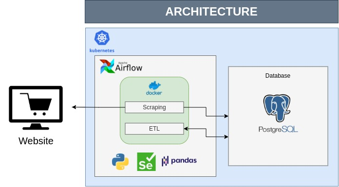

# etl-pipeline-scraping
This Project is an implementation of the data pipeline which consumes the price of laptop from e-commerce website and store it to database and does ETL to data warehouse. The pipeline infrastructure is built using popular, open-source projects.

## Architecture

## Explanation
Scraping and ETL tasks are executed periodically by Airflow DAGs
* First task is scraping. Using Python and Selenium to do this task and then store data to postgresql database (Using SQLAlchemy).
* Second task is ETL. Extracting data from landing in database and then do some transformation. Finally, store data to data warehouse in postgres database.
* Airflow and Postgresql Database are deployed into kubernetes cluster
* All the tasks are made into docker image
* Running the tasks using KubernetedPodOPerator
